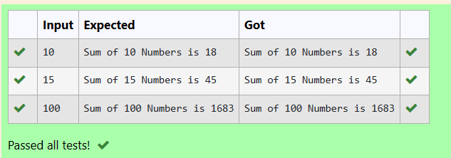
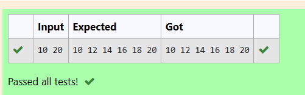

# EX2(A)Loops
Developed by: ARSHITHA MS

Register number: 212223240015
 ## AIM:
 To write a program to write a C Program to print the sum of N numbers which is divisible by 3 and to print  even numbers ranging from M to N (including M and N values).
 ## ALGORITHM:
 1.Start the program

 2.Declare the variables

 3.Get input from the user.

 4.Use for loop.
 
 5.Check if the number is divisible by 3 for 1st program.

 6.Check if the number is divisible by 2 for 2nd program.

 7.Print the output.
 ## PROGRAM
 ### Program 1:
 ```
#include<stdio.h>
int main()
{
  int n,i,sum=0;
  scanf("%d",&n);
  for(i=1;i<=n;i++)
  {
      if (i%3==0)
      sum+=i;
  }
  printf("Sum of %d Numbers is %d",n,sum);
  return 0;
}
```
### Program 2:
```
#include<stdio.h>
int main()
{
    int m,n,i;
    scanf("%d %d",&m,&n);
    for(i=m;i<=n;i++)
    if(i%2==0)
    {
        printf("%d ",i);
    }
    return 0;
}
```

## OUTPUT:
### Output 1:



### Output 2:


## RESULT:
Thus the program to print the sum of N numbers which is divisible by 3 and to print  even numbers ranging from M to N (including M and N values) is executed successfully.